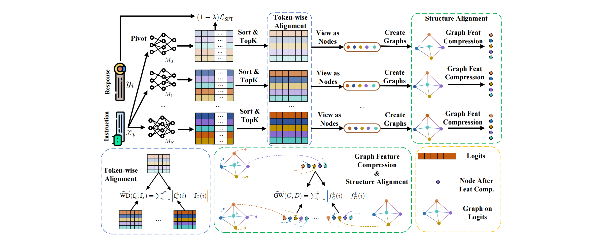
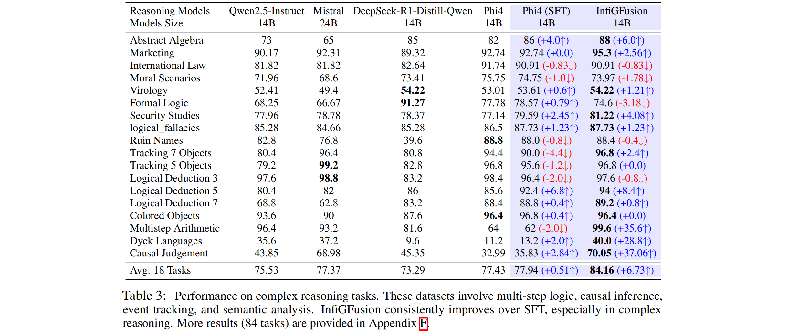

<h1 align="center">
InfiGFusion: Graph-on-Logits Distillation via Efficient Gromov-Wasserstein for Model Fusion
</h1>

<h4 align="center">

 

  
</h4>

**InfiGFusion** is the first structure-aware fusion framework for large language models that models semantic dependencies among logits using feature-level graphs. We introduce a novel Graph-on-Logits Distillation (GLD) loss that captures cross-dimension interactions via co-activation graphs and aligns them using an efficient, provable approximation of Gromov-Wasserstein distance (reducing complexity from O(n^4) to O(nlogn)). Our released **InfiGFusion-14B** model consistently shows better performance, achieving +35.6 on Multistep Arithmetic and +37.06 on Causal Judgement over SFT, demonstrating superior multi-step and complex logic inference.

## 🎉 News
🎉 The ckpt model, InfiGFusion-14B, has been released on Huggingface! ! !

## 📕 Model Summary 

|                         |                                                                               |     
|-------------------------|-------------------------------------------------------------------------------|
| **Developers**          | Reallm-Labs                                                            |
| **Description**         | InfiGFusion is an open fusion model series designed to fuse multiple domain LLMs into a single LLM. It excels in multi-step and relational inference, enabling robust performance across complex reasoning tasks.|
| **Architecture**        | 14B parameters, dense decoder-only Transformer model                          |
| **Inputs**              | Text, best suited for prompts in the chat format                              |
| **Max Context length**  | 16K tokens                                                                    |
| **Fusing input length** | 4K tokens                                                           |
| **Fusing time**         | 192 hours                                                                       |
| **Fusing data**         | 520M tokens                                                                   |
| **Outputs**             | Generated text in response to input                                           |
| **Status**              | Static model trained on an offline dataset                                    |
| **License**             | MIT                                                                         |

## 🩺 Intended Use 
|                            |                   |
| -------------------------- | ------------------|
| **Primary Use Cases**      | `InfiGFusion` is designed to accelerate research on language model fusion and serve as a foundation for generative AI-powered features. It is suitable for building general-purpose AI systems and applications (primarily in English), especially in scenarios that require:  1. Operation in memory- or compute-constrained environments. 2. Low-latency inference. 3. Advanced reasoning and logical inference.|
| **Out-of-Scope Use Cases** | `InfiGFusion` is not specifically optimized or evaluated for all downstream tasks. As such:  1. Developers should consider the general limitations of language models and carefully evaluate performance, safety, and fairness before deploying in sensitive or high-stakes applications. 2. Use of the model must comply with all applicable laws and regulations (e.g., data privacy, export controls), particularly given its English-language focus. 3. This Model Card does not alter or restrict the terms of the model’s open-source license. |

## 💼 Data Overview 

### 📚 Training Data

We construct a novel multi-task training dataset comprising **130k curated examples** across three major domains: **general reasoning**, **mathematics**, and **code generation**.

1. **General Reasoning (52K samples)**
   Samples are sourced from the [Infinity-Instruct](https://huggingface.co/datasets/BAAI/Infinity-Instruct) dataset, a high-quality instruction-following corpus created through expert filtering.

2. **Mathematics (39K samples)**
   Questions are drawn from the [NuminaMath-1.5](https://huggingface.co/datasets/AI-MO/NuminaMath-1.5) dataset—an advanced benchmark for competition-level math spanning Algebra, Geometry, Combinatorics, Calculus, Inequalities, Logic & Puzzles, and Number Theory.
   Answers are distilled from the [DeepSeek-R1-671B](https://huggingface.co/datasets/a-m-team/AM-DeepSeek-R1-Distilled-1.4M) model by the AM team.

3. **Code Generation (39K samples)**
   We used [KodCode-V1-SFT-R1](https://arxiv.org/abs/2405.17300), a dataset with 268K code samples. Each example was processed by our pivot model to generate five completions. These were sandbox-evaluated, and samples where at least one generation failed were flagged. From these, we filtered and distilled 39K high-quality examples.

| **Type**          | **General**       | **Math**       | **Code**          |
| ----------------- | ----------------- | -------------- | ----------------- |
| **Dataset**       | Infinity-Instruct | NuminaMath-1.5 | KodCode-V1-SFT-R1 |
| **Original Size** | 1.4M              | 1.4M           | 268K              |
| **Filtered Size** | 52K               | 39K            | 39K               |

## 🎨 Overview

## 🎯 Results

